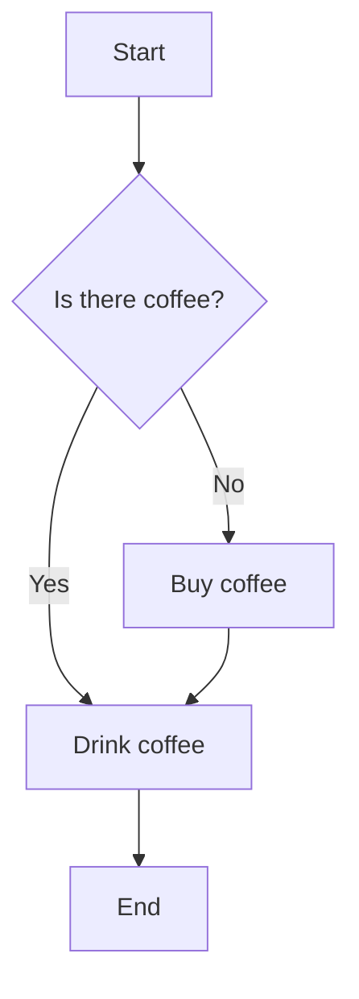
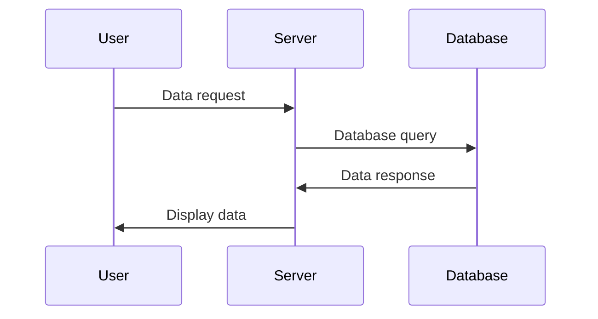
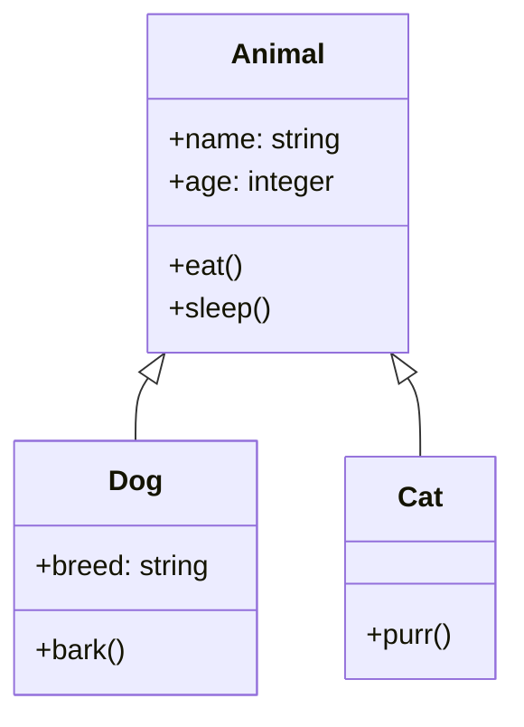
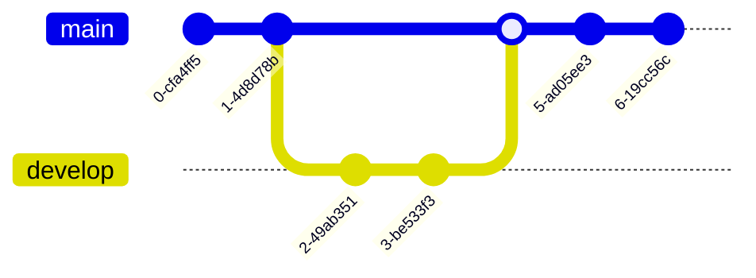
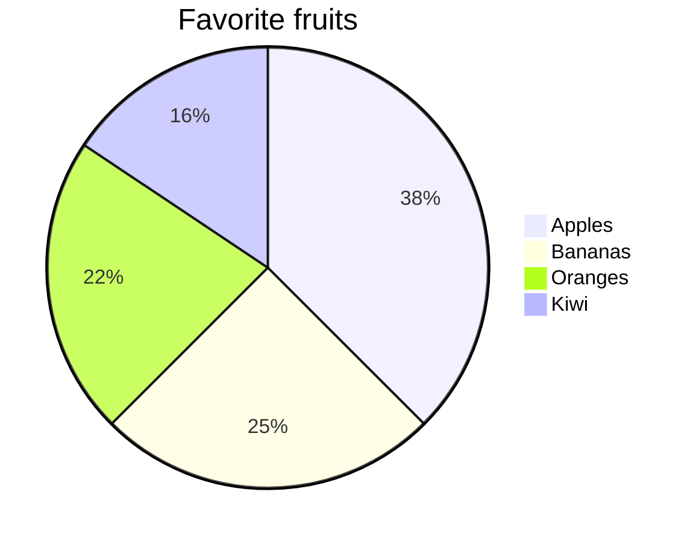
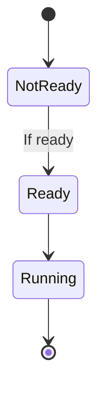
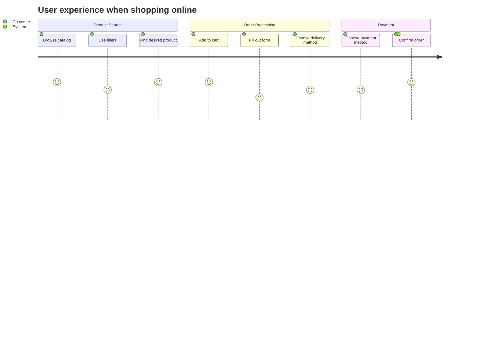
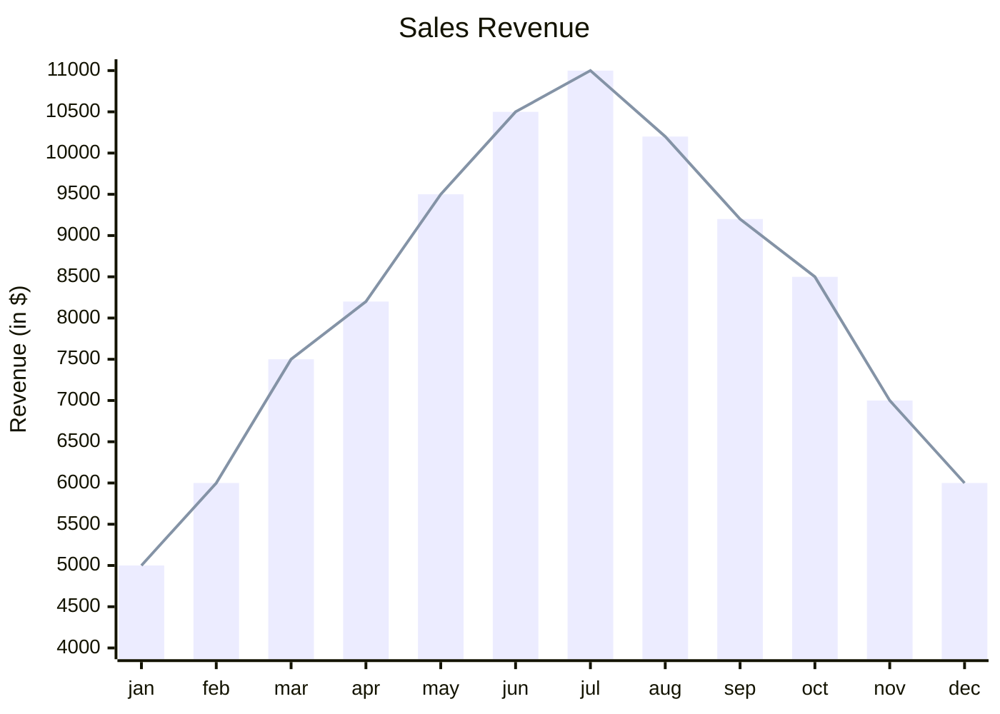

# Mermaid Syntax:

## Links:

1. https://github.com/mermaid-js/mermaid
2. https://docs.github.com/en/get-started/writing-on-github/working-with-advanced-formatting/creating-diagrams

# Examples of Mermaid usage:

## 1. Block diagram:

```
graph TD
    A[Start] --> B{Is there coffee?}
    B -->|Yes| C[Drink coffee]
    B -->|No| D[Buy coffee]
    C --> E[End]
    D --> C
```



## 2. Sequence diagram:

```
sequenceDiagram
    participant User
    participant Server
    participant Database
    User->>Server: Data request
    Server->>Database: Database query
    Database->>Server: Data response
    Server->>User: Display data
```



## 3. Class diagram:

```
classDiagram
    class Animal {
        +name: string
        +age: integer
        +eat()
        +sleep()
    }
    class Dog {
        +breed: string
        +bark()
    }
    class Cat {
        +purr()
    }
    Animal <|-- Dog
    Animal <|-- Cat
```



## 4. Git Flow diagram:

```
gitGraph
    commit
    commit
    branch develop
    checkout develop
    commit
    commit
    checkout main
    merge develop
    commit
    commit
```



## 5. Pie chart:

```
pie title Favorite fruits
    "Apples" : 120
    "Bananas" : 80
    "Oranges" : 70
    "Kiwi" : 50
```



## 6. State diagram:

```
stateDiagram-v2
    [*] --> NotReady
    NotReady --> Ready: If ready
    Ready --> Running
    Running --> [*]
```



## 7. User journey diagram:

```
journey
    title User experience when shopping online
    section Product Search
      Browse catalog: 5: Customer
      Use filters: 4: Customer
      Find desired product: 5: Customer
    section Order Processing
      Add to cart: 5: Customer
      Fill out form: 3: Customer
      Choose delivery method: 4: Customer
    section Payment
      Choose payment method: 4: Customer
      Confirm order: 5: Customer, System
```




## 8. XY chart

```
xychart-beta
    title "Sales Revenue"
    x-axis [jan, feb, mar, apr, may, jun, jul, aug, sep, oct, nov, dec]
    y-axis "Revenue (in $)" 4000 --> 11000
    bar [5000, 6000, 7500, 8200, 9500, 10500, 11000, 10200, 9200, 8500, 7000, 6000]
    line [5000, 6000, 7500, 8200, 9500, 10500, 11000, 10200, 9200, 8500, 7000, 6000]
```




