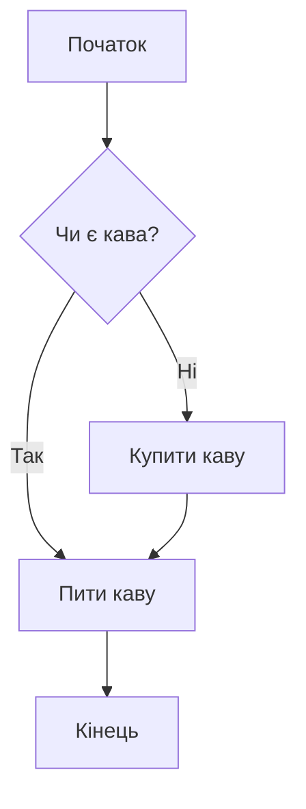
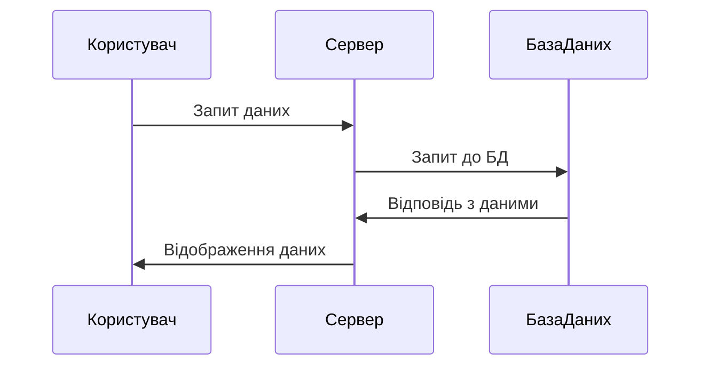
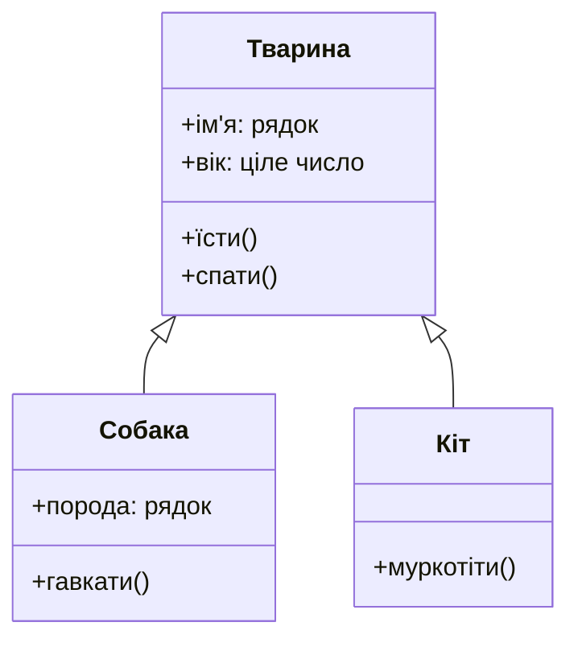
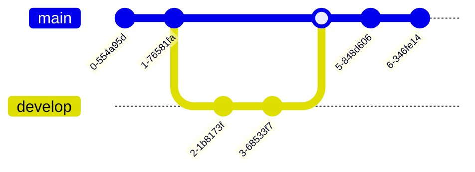
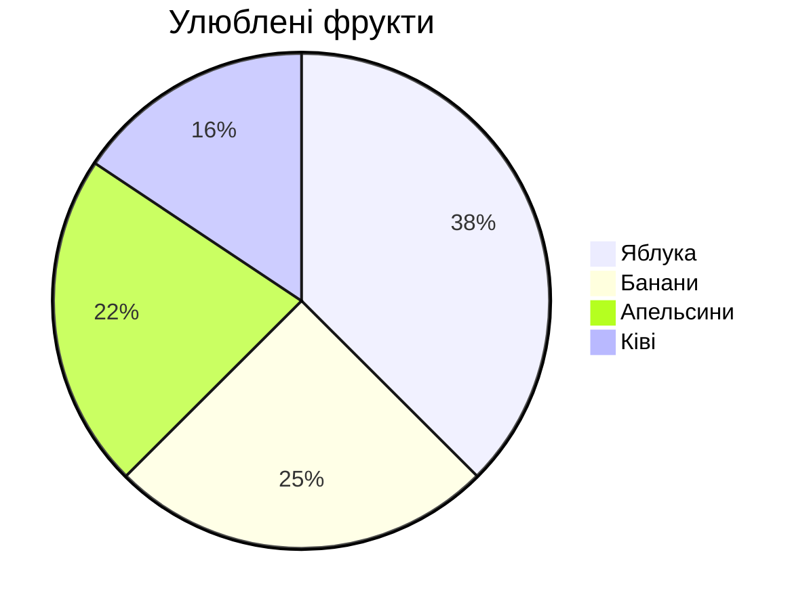
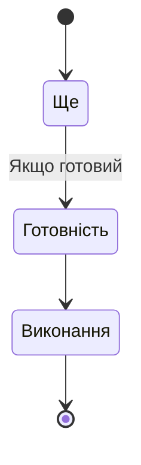
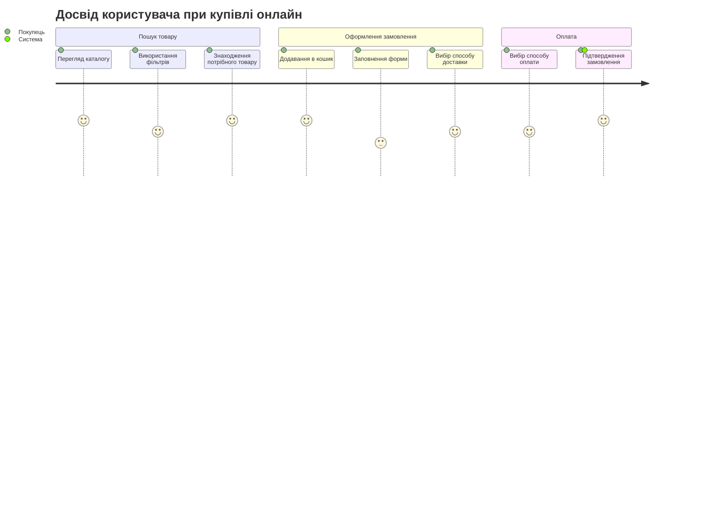
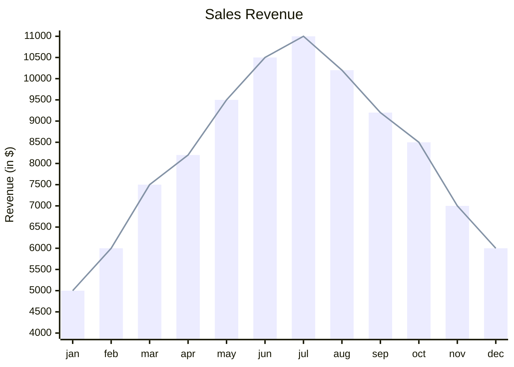

# Mermaid Syntax:

## Links:

1. https://github.com/mermaid-js/mermaid
2. https://docs.github.com/en/get-started/writing-on-github/working-with-advanced-formatting/creating-diagrams

# Examples of Mermaid usage:

## 1. Block diagram:

```
graph TD
    A[Початок] --> B{Чи є кава?}
    B -->|Так| C[Пити каву]
    B -->|Ні| D[Купити каву]
    C --> E[Кінець]
    D --> C
```



## 2. Діаграма послідовності:

```
sequenceDiagram
    participant Користувач
    participant Сервер
    participant БазаДаних
    Користувач->>Сервер: Запит даних
    Сервер->>БазаДаних: Запит до БД
    БазаДаних->>Сервер: Відповідь з даними
    Сервер->>Користувач: Відображення даних
```



## 3. Діаграма класів:

```
classDiagram
    class Тварина {
        +ім'я: рядок
        +вік: ціле число
        +їсти()
        +спати()
    }
    class Собака {
        +порода: рядок
        +гавкати()
    }
    class Кіт {
        +муркотіти()
    }
    Тварина <|-- Собака
    Тварина <|-- Кіт
```



## 4. Діаграма Git Flow:

```
gitGraph
    commit
    commit
    branch develop
    checkout develop
    commit
    commit
    checkout main
    merge develop
    commit
    commit
```



## 5. Кругова діаграма:

```
pie title Улюблені фрукти
    "Яблука" : 120
    "Банани" : 80
    "Апельсини" : 70
    "Ківі" : 50
```



## 6. Діаграма стану:

```
stateDiagram-v2
    [*] --> Ще
    Ще --> Готовність: Якщо готовий
    Готовність --> Виконання
    Виконання --> [*]
```



## 7. Діаграма подорожі користувача:

```
journey
    title Досвід користувача при купівлі онлайн
    section Пошук товару
      Перегляд каталогу: 5: Покупець
      Використання фільтрів: 4: Покупець
      Знаходження потрібного товару: 5: Покупець
    section Оформлення замовлення
      Додавання в кошик: 5: Покупець
      Заповнення форми: 3: Покупець
      Вибір способу доставки: 4: Покупець
    section Оплата
      Вибір способу оплати: 4: Покупець
      Підтвердження замовлення: 5: Покупець, Система
```




## 8. ХУ діаграма

```
xychart-beta
    title "Sales Revenue"
    x-axis [jan, feb, mar, apr, may, jun, jul, aug, sep, oct, nov, dec]
    y-axis "Revenue (in $)" 4000 --> 11000
    bar [5000, 6000, 7500, 8200, 9500, 10500, 11000, 10200, 9200, 8500, 7000, 6000]
    line [5000, 6000, 7500, 8200, 9500, 10500, 11000, 10200, 9200, 8500, 7000, 6000]
```




